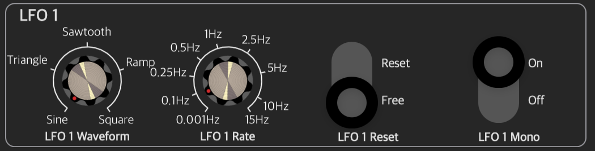

# SinteziloUI

SwiftUI knobs, rockers and parameter groups for Audio Unit parameters.

## ParameterViewModel

For discrete rather than continuous values, the following flag will be respected:

| Flag | 
| ----------- | 
| ``flag_ValuesHaveStrings`` |

The following flags will be respected when scaling values between the internal parameter representation and the display representation:

| Flag | 
| ----------- |
| ``flag_DisplayLogarithmic`` | 
| ``flag_DisplayExponential`` |
| ``flag_DisplaySquared`` | 
| ``flag_DisplaySquareRoot`` |
| ``flag_DisplayCubed`` |
| ``flag_DisplayCubeRoot`` |

The following units are explicitly handled:
    
| Unit      | Description |
| ----------- | ----------- |
| ``percent``      | Shown as a percentage between the minimum and maximum values. |
| ``hertz``   | Shown as per the default formatting; will move from Hz to kHz when the value is > 1000 etc. |
| ``milliseconds`` | For values less than one second, the value in milliseconds will be shown. Otherwise, the value in seconds will be shown. |
| ``seconds`` | as per ``milliseconds`` |
| ``BPM`` | shown as "x BPM" with up to two decimal places. |
| ``midiNoteNumber`` | Shown as the note name and minus-one-based octave e.g. C#1 |

Other units whill be presented generically with up to two decimal places.
    
## ParameterKnob

## ParameterRocker

## ParameterGroupViewModel

## ParameterGroup
